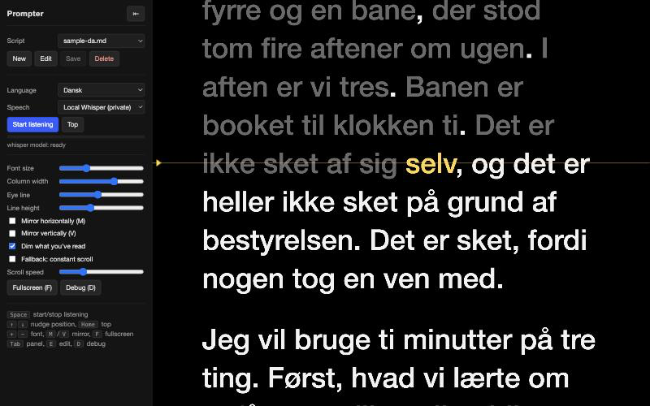

# Prompter

A voice-following teleprompter that runs on your Mac. It listens to the microphone, works out where you are in the script, and keeps that line at your eye level. Stop talking and it stops. Skip a paragraph and it catches up. Re-read a sentence and it goes back. Danish and English.



Speech recognition runs locally through Whisper on Apple silicon (MLX). Nothing leaves the machine. A browser-based cloud recognizer is available as an opt-in fallback.

## Why local Whisper

The commercial prompters that follow your voice send the audio to a server, and the ones that run offline do not speak Danish. Apple's on-device transcriber in macOS 26 has no Danish either. Whisper large-v3-turbo does, and on an M-series GPU through MLX it transcribes a six-second window in about a quarter of a second, which is fast enough to follow a speaker in real time with a lag of roughly one second. So the whole thing runs as a small FastAPI sidecar next to a static web page, and the script text never leaves the laptop. That matters when the script is a board presentation.

## Setup

Requires macOS on Apple silicon, [uv](https://docs.astral.sh/uv/) (`brew install uv`) and Node 18+ for the tests.

```bash
cd prompter
uv sync
uv run uvicorn server.main:app --host 127.0.0.1 --port 8765
```

Open http://localhost:8765 in Chrome. The first start downloads `whisper-large-v3-turbo` (about 1.6 GB) into the Hugging Face cache. The left panel shows `whisper model: ready` when it is loaded.

## Use

1. Put scripts as `.md` or `.txt` files in `scripts/`, or create them with **New** in the app. Markdown headings render as section titles. Blank lines separate paragraphs.
2. Pick language and speech backend, press **Start listening** (or Space), grant the microphone once.
3. Read. The current word is yellow, read text is dimmed, the eye-line marker shows where the current line is held.

Keys: Space start/stop, arrows nudge, Home top, `+`/`-` font, `M` mirror horizontally, `V` mirror vertically (beam-splitter rigs), `F` fullscreen, `Tab` hide panel, `E` edit, `D` debug strip.

Click any word to move the position there.

## How it tracks

The recognizer produces a rolling, noisy transcript. Every update, the aligner (`web/aligner.js`) takes the last six spoken words and searches the script from 30 words behind the cursor to 40 ahead for the position that best explains them. Matching is fuzzy at the word level (Levenshtein ratio, prefix tolerance for inflection, and merge/split moves for compounds that Whisper writes as two words). At least three words must match and half the tail must match before the cursor moves. Backward moves need a stronger match than forward ones. One stray word never moves anything. Silence produces no hypothesis, so nothing moves.

The script words around the cursor are sent to Whisper as a decoder prompt, which helps with names, product terms and Danish compounds.

## Backends

| Backend | Where audio goes | Lag | Notes |
|---|---|---|---|
| Local Whisper | Nowhere. MLX on your GPU. | ~1 s | Default. 6 s rolling window, transcribed every 0.8 s while you speak. |
| Browser API | Google (Chrome) or Apple (Safari) | ~0.5 s | Zero setup. Chrome restarts the session after silence; the app handles that. |

Server tuning through environment variables: `PROMPTER_MODEL` (default `mlx-community/whisper-large-v3-turbo`; `mlx-community/whisper-large-v3-mlx` is more accurate for Danish and slower), `PROMPTER_WINDOW` (seconds, default 6), `PROMPTER_STEP` (seconds between transcriptions, default 0.8), `PROMPTER_SILENCE_RMS` (default 0.006), `PROMPTER_SCRIPTS` (folder).

## Tests

```bash
npm test
```

Streaming a WAV file through the Whisper socket without a microphone:

```bash
say -v Sara "Godmorgen alle sammen, og tak fordi I tog jer tid." -o /tmp/da.aiff
afconvert -f WAVE -d LEI16@16000 -c 1 /tmp/da.aiff /tmp/da.wav
uv run python tests/ws_client.py /tmp/da.wav da
```

In the browser console, `__prompter.hyp("some spoken words")` feeds a hypothesis straight into the aligner.

## Layout

```
server/main.py     FastAPI: static files, scripts API, /ws/stt
server/stt.py      ring buffer + MLX Whisper worker + silence gate
web/aligner.js     pure alignment logic (tested)
web/app.js         UI state, rendering, scrolling, keys
web/stt/           browser and whisper backends, PCM worklet
scripts/           your scripts
tests/             aligner tests, WebSocket test client
```
